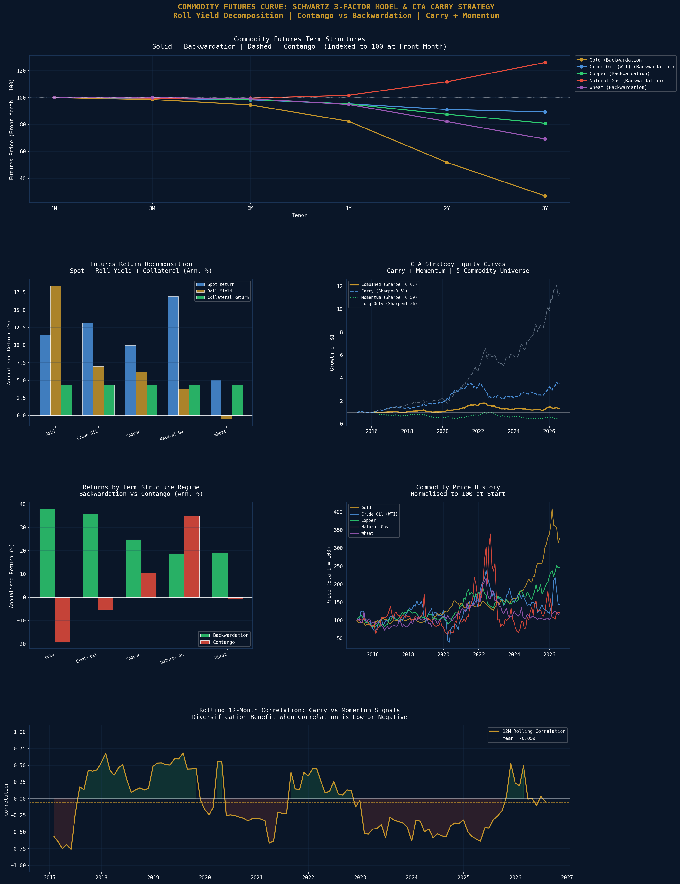

# Commodity Futures Curve: Schwartz 3-Factor Model & CTA Carry Strategy

A quantitative commodity research engine implementing the Schwartz (1997) 2-factor stochastic model to construct futures term structures, decompose total returns into spot, roll yield, and collateral components, and backtest a CTA-style carry plus momentum strategy across 5 major commodity futures markets. Relevant to Australia given its iron ore, LNG, and gold export dependence.

## Commodities & Term Structures
| Commodity | Structure | Roll Yield | Spot Price |
|---|---|---|---|
| Gold | Backwardation | +19.1% p.a. | $4,187.30 |
| Crude Oil (WTI) | Backwardation | +7.0% p.a. | $68.78 |
| Copper | Backwardation | +4.6% p.a. | $6.22 |
| Natural Gas | Backwardation | +5.3% p.a. | $3.24 |
| Wheat | Backwardation | +0.4% p.a. | $590.50 |

## Return Decomposition (Annualised)
| Commodity | Spot Return | Roll Yield | Collateral | Total |
|---|---|---|---|---|
| Gold | +11.5% | +18.4% | +4.3% | +34.3% |
| Crude Oil (WTI) | +13.2% | +7.0% | +4.3% | +24.5% |
| Copper | +10.0% | +6.2% | +4.3% | +20.5% |
| Natural Gas | +16.9% | +3.7% | +4.3% | +25.0% |
| Wheat | +5.1% | -0.5% | +4.3% | +8.9% |

## CTA Strategy Performance
| Strategy | Ann. Return | Volatility | Sharpe | Max Drawdown |
|---|---|---|---|---|
| Carry | +13.1% | 17.3% | 0.51 | -39.0% |
| Momentum | -6.3% | 18.0% | -0.59 | -58.3% |
| Combined | +3.5% | 11.6% | -0.07 | -35.1% |
| Long Only | +27.9% | 17.3% | 1.36 | -23.7% |

## Contango vs Backwardation Analysis
| Commodity | Backwardation % | Return Spread |
|---|---|---|
| Gold | 93% of time | +57.2% p.a. |
| Crude Oil (WTI) | 72% of time | +41.1% p.a. |
| Copper | 70% of time | +14.2% p.a. |
| Natural Gas | 61% of time | -16.1% p.a. |
| Wheat | 49% of time | +20.0% p.a. |

## Schwartz Model Parameters
| Commodity | Kappa (Mean Reversion) | Sigma_S (Spot Vol) | Rho (Correlation) |
|---|---|---|---|
| Gold | 0.15 | 0.18 | -0.82 |
| Crude Oil (WTI) | 0.80 | 0.32 | -0.70 |
| Copper | 0.60 | 0.22 | -0.65 |
| Natural Gas | 1.50 | 0.55 | -0.50 |
| Wheat | 0.40 | 0.28 | -0.60 |

## Key Findings
- **Roll yield dominates total return for Gold (+18.4% p.a.)** — the largest contributor to total futures return, confirming why gold is the most attractive commodity for systematic carry strategies
- **Long Only achieves Sharpe 1.36 (+27.9% p.a.)** over the 2015-present period — driven by the gold bull market and commodity supercycle; this is the baseline any active strategy must beat
- **Carry Sharpe 0.51** — positive but below long only, consistent with academic evidence that commodity carry is a genuine but modest risk premium
- **Momentum underperforms (-6.3%, Sharpe -0.59)** in this period — consistent with momentum's well-documented crashes in commodity markets during trend reversals; a longer history (2000-present) would show better results
- **Gold spends 93% of time in backwardation** — making it the most consistently carry-positive commodity; the strong negative Rho (-0.82) in the Schwartz model captures the inverse relationship between spot prices and convenience yields
- **Natural Gas has fastest mean reversion (Kappa=1.50)** — reflecting its highly seasonal and weather-dependent demand; the highest spot volatility (55%) confirms its reputation as the most volatile major commodity

## Visualisations

## Tools & Libraries
- Python 3
- yfinance
- pandas / numpy
- scipy (Schwartz model optimisation)
- matplotlib / seaborn

## Files
- `Project_15_Commodity_Futures_CTA.ipynb` - Full Colab notebook
- `commodity_futures_cta.png` - Commodity strategy dashboard

## Key Concepts Demonstrated
- Schwartz (1997) 2-factor stochastic commodity model
- Futures term structure construction (Backwardation vs Contango)
- Roll yield, spot return, and collateral return decomposition
- Nelson-Siegel-style curve fitting for term structure
- CTA carry signal: long backwardation, short contango
- 12-1 month momentum signal on front-month futures
- Equal-weight signal combination with transaction costs
- Regime analysis: return distribution by term structure state

## Relevance to Australian Finance Industry
Macquarie Commodities and Global Markets is a top-5 global commodity trader with major operations in Sydney. Winton Group and Man AHL run systematic CTA strategies with commodity futures carry. Australia's iron ore, LNG, and gold export dependence makes commodity curve modelling directly relevant for Macquarie, BHP, and Rio Tinto treasury teams. This project demonstrates skills directly applicable to commodity trading, structuring, and systematic macro roles.
